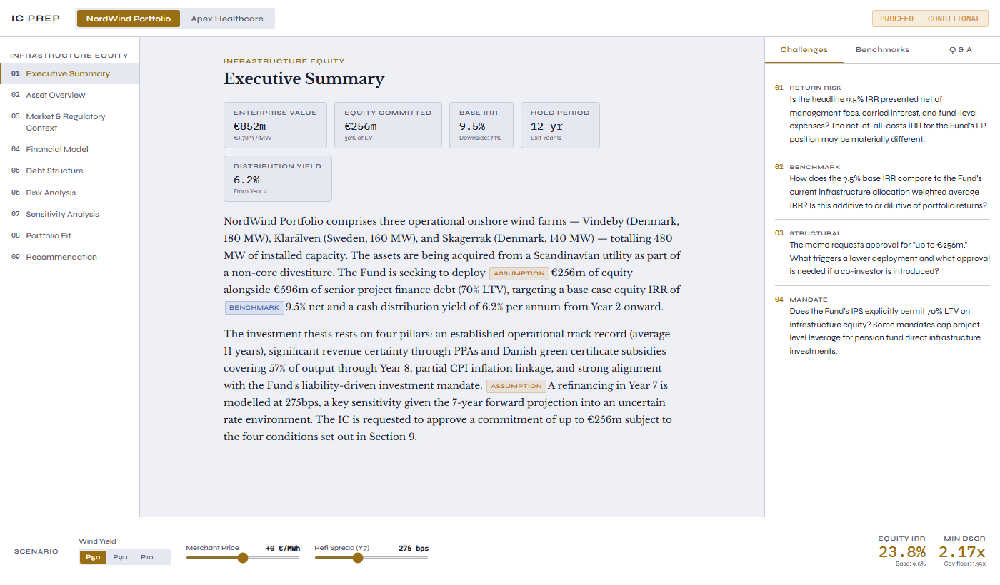
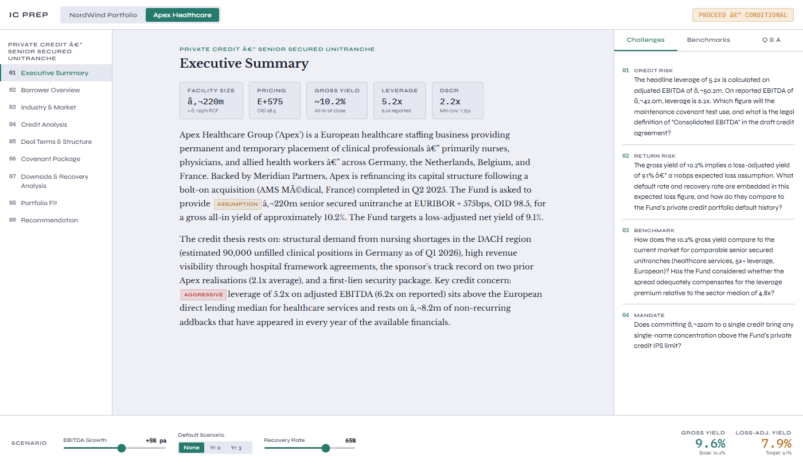

# IC Prep Room

An investment committee preparation tool that arms memo reviewers with 
independent research, challenge questions, and benchmarks — before the 
deal team walks in.

## Live demo

[View on GitHub Pages](https://kiranmanjunath-AI.github.io/ic-prep-room)

## Screenshots




## What it does

IC members often receive dense memos hours before a meeting with limited 
time to identify weak assumptions. IC Prep Room solves this by surfacing:

- **Challenge questions** — targeted questions for each section, tagged 
  by risk type (Aggressive, Conservative, Assumption, Benchmark)
- **Independent benchmarks** — market comparables the memo may not include
- **Scenario analysis** — stress-test key variables (price, yield, rates) 
  interactively
- **Q&A panel** — capture and track questions raised during review

## Demo deals included

- **NordWind Portfolio** — European onshore wind infrastructure equity (480 MW)
- **Apex Healthcare** — Private credit, senior secured unitranche (€220m)

## Stack

- Vanilla HTML/CSS/JS — no dependencies, no build step
- Deployable as a static site (GitHub Pages, Netlify, etc.)

## Getting started

```bash
git clone https://github.com/kiranmanjunath-AI/ic-prep-room
cd ic-prep-room
open index.html
```

Or open `index.html` directly in any browser — no server needed.

## Extending it

To add a new deal, add an entry to the `DEALS` object in `index.html` 
following the existing structure. Each deal has sections, and each section 
has content, challenges, and benchmarks.

## Built with AI assistance
Developed using Claude Code.
